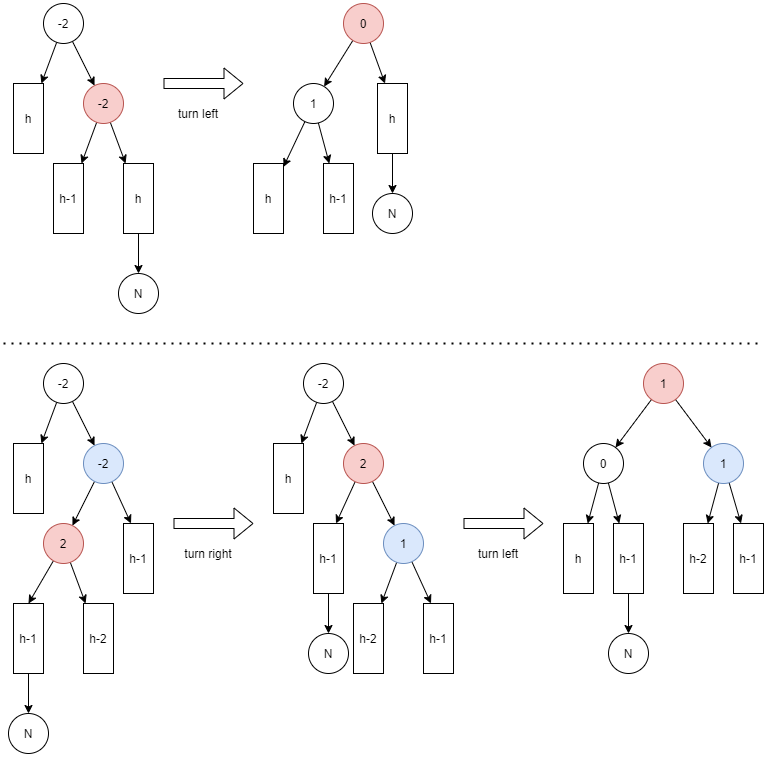
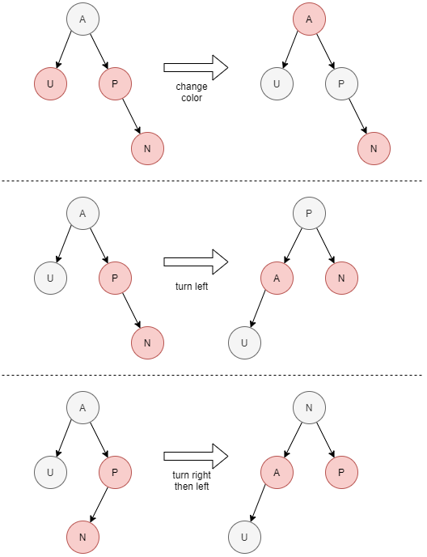
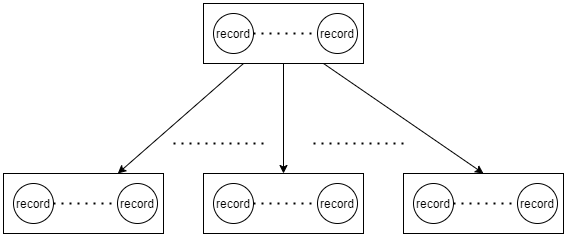
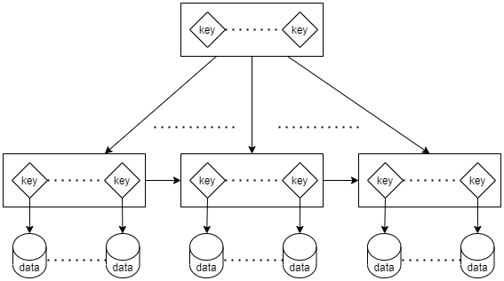

# Search Sama


# Feature

- Implement binary search Tree (AVL Tree).
- Implement binary search Tree (RB Tree).
- Implement m-WAY Search Trees (B Tree).
- Implement m-WAY Search Trees (B+ Tree).

# Skill

- TypeScript
- Jest
- CircleCI

# Run Test Suites

```
yarn
yarn test
```

# About

- LinkIn https://www.linkedin.com/in/owen-hong-469882165/

# Illustrate

- AVL



- Red-Black



- B Tree



- B+ Tree

